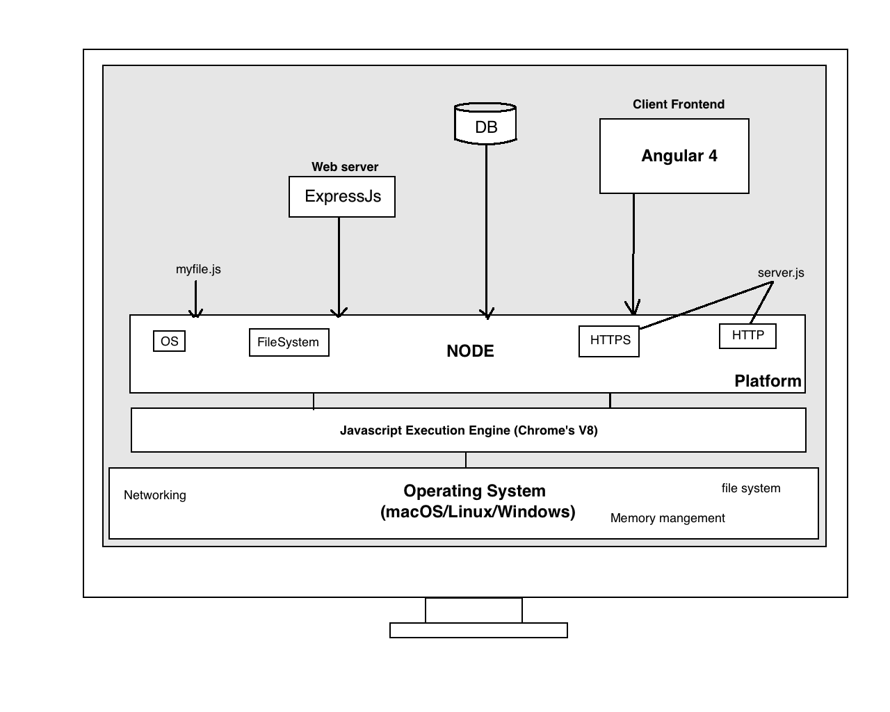
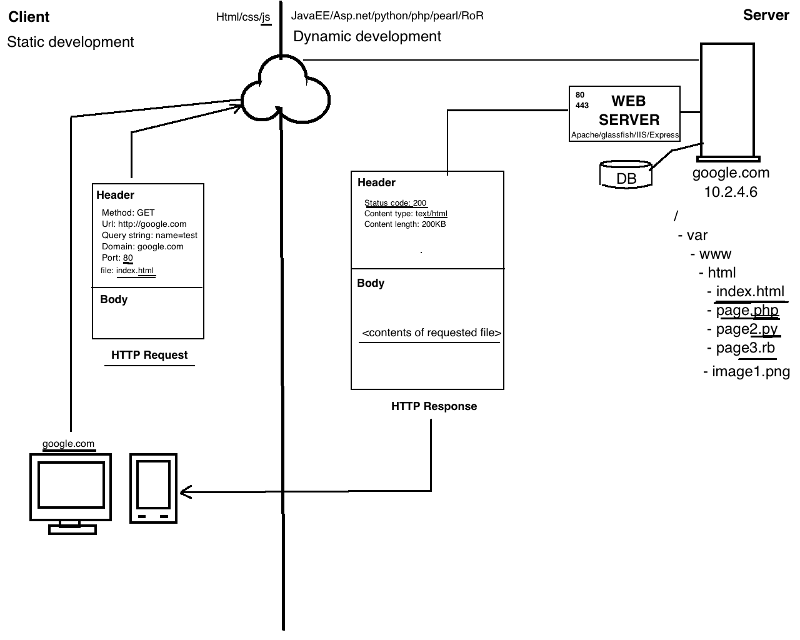
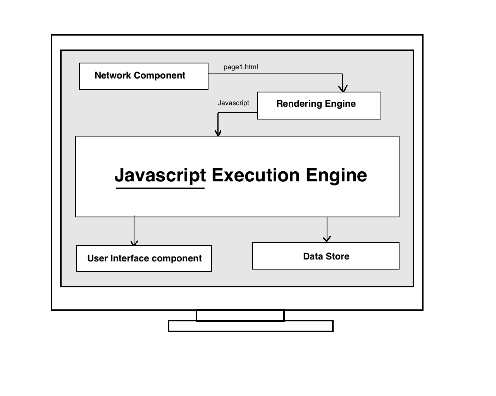
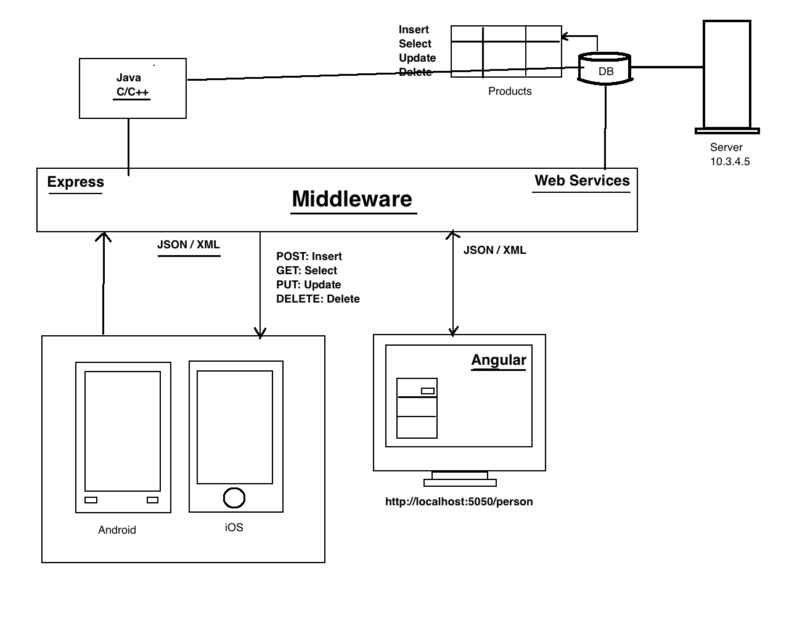

# MEAN Demo App

This app demonstrates use of MEAN technologies for end-to-end fullstack JavaScript development.

## Technologies
1. Node (JavaScript Execution Engine. Chrome's V8)
2. Express (Server)
3. Angular 4 (Client Front-end)
4. MongoDB (Database Server)

## Concepts

### MEAN Architecture

1. Web Services in JS
2. High Performance using main thread
3. Reduced HTML to JS renering time.
4. Highly optimised Chrome's V8

### Client-Server Flow

### Browser Components

### Sample MEAN Web Service

## Notes

1. TypeScript [notes](docs/notes/TypeScript.docx)
2. Angular [notes](docs/notes/Angular.docx)

